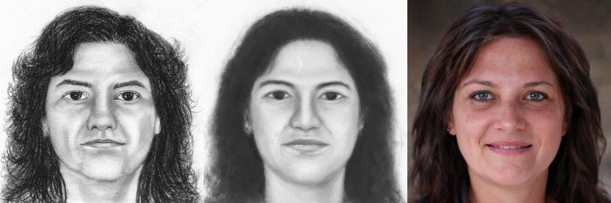

# Latent-Space-Anchoring

PyTorch implementation of **Domain-Scalable Unpaired Image Translation via Latent Space Anchoring**

[Siyu Huang<sup>*</sup>](https://siyuhuang.github.io) (Harvard), [Jie An<sup>*</sup>](https://www.cs.rochester.edu/u/jan6/) (Rochester), [Donglai Wei](https://donglaiw.github.io/) (BC), [Zudi Lin](https://zudi-lin.github.io/) (Amazon Alexa), [Jiebo Luo](https://www.cs.rochester.edu/u/jluo/) (Rochester), [Hanspeter Pfister](https://vcg.seas.harvard.edu/people/hanspeter-pfister) (Harvard)  
*IEEE Transactions on Pattern Analysis and Machine Intelligence (TPAMI)*

[[Paper]](https://ieeexplore.ieee.org/document/10158033)

<p align="center">

</p>

Given an **unpaired image-to-image translation (UNIT)** model trained on certain domains, it is challenging to incorporate new domains. This work includes a domain-scalable UNIT method, termed as *latent space anchoring*, anchors images of different domains to the same latent space of frozen GANs by learning lightweight encoder and regressor models to reconstruct single-domain images. In inference, the learned encoders and decoders of different domains can be arbitrarily combined to translate images between any two domains without fine-tuning:

<p align="center">

</p>

## Installation
We recommend installing with [Anaconda](https://docs.anaconda.com/anaconda/install/). All dependencies are provided in `env.yaml`.
```
conda env create -f env.yaml
conda activate lsa
```

## Pretrained Models
Please download the pre-trained models from the following links. 
| Name | Enc/Dec Domain | Generator Backbone 
| :--- | :---------- | :----------
|[seg2ffhq.pt](https://drive.google.com/file/d/1En0y5GTE_U7gWq0jcGSncK0seVFnEfUx/view?usp=sharing)  | facial segmentation mask ([CelebAMask-HQ](https://github.com/switchablenorms/CelebAMask-HQ)) | StyleGAN2 trained on [FFHQ](https://github.com/NVlabs/ffhq-dataset) face.
|[sketch2ffhq.pt](https://drive.google.com/file/d/1_ks5FJFRi489UagwxA5L4ddILMfdCN30/view?usp=sharing)  | facial sketch ([CUFSF](http://mmlab.ie.cuhk.edu.hk/archive/cufsf/)) | StyleGAN2 trained on [FFHQ](https://github.com/NVlabs/ffhq-dataset) face.
|[cat2dog.pt](https://drive.google.com/file/d/1V8spSm-pKJXoBZjSrfU3iO2nEYpJqgDx/view?usp=sharing)  | cat face ([AFHQ-cat](https://github.com/clovaai/stargan-v2/blob/master/README.md)) | StyleGAN2 trained on [AFHQ-dog](https://github.com/clovaai/stargan-v2/blob/master/README.md).

In addition, we provide the auxiliary pre-trained models used for training models of this work.
| Name | Description
| :--- | :----------
|[stylegan2-ffhq-config-f.pt](https://drive.google.com/file/d/1A3rXFwAl2Bkuf6Sd4LUqzrjFmgHT7oM-/view?usp=sharing) | StyleGAN2 on [FFHQ](https://github.com/NVlabs/ffhq-dataset) face.
|[psp_ffhq_encode.pt](https://drive.google.com/file/d/1WmG-Sfcubv3QNwdMsOwW3QUeLiW0nCrf/view?usp=sharing)  | The image encoder of [StyleGAN2-FFHQ](https://github.com/rosinality/stylegan2-pytorch).
|[model_ir_se50.pth](https://drive.google.com/file/d/1lcrPgEA7PZk9mQCG2BS7DP6FUdl-4sm6/view?usp=sharing) | [IR-SE50](https://github.com/TreB1eN/InsightFace_Pytorch) used for StyleGAN2 encoder's weight initialization.

## Testing
### CelebAMask-to-FFHQ
<p align="left">

</p>
input regressor output generator output

Unpaired image translation from CelebAMask-HQ mask to FFHQ image.

Please download [CelebAMask-HQ dataset](https://github.com/switchablenorms/CelebAMask-HQ), put it under `./data/`. Download pre-trained model [seg2ffhq.pt](https://drive.google.com/file/d/1En0y5GTE_U7gWq0jcGSncK0seVFnEfUx/view?usp=sharing), put it under `./pretrained_models`. The folder structure is
```
Latent-Space-Anchoring
├── data
│   ├── CelebAMask-HQ
│   │   ├── face_parsing
│   │   │   ├── Data_preprocessing
│   │   │   ├── ├── train_img
│   │   │   ├── ├── train_label
│   │   │   ├── ├── test_img
│   │   │   ├── ├── test_label
├── pretrained_models
│   ├── seg2ffhq.pt
├── commands
│   ├── test_seg2ffhq.sh
```

Run:
```
bash commands/test_seg2ffhq.sh
```

### Sketch-to-FFHQ
<p align="left">

</p>

Unpaired image translation from CUFSF facial sketch to FFHQ image. Figures: input, regressor output, generator output.

Please download ([CUFSF](http://mmlab.ie.cuhk.edu.hk/archive/cufsf/), put it under `./data/`. Manually split the dataset into training and test sets (we use the first 1k images as training set and the rest as test set). Download pre-trained model [sketch2ffhq.pt](https://drive.google.com/file/d/1_ks5FJFRi489UagwxA5L4ddILMfdCN30/view?usp=sharing), put it under `./pretrained_models`. The folder structure is
```
Latent-Space-Anchoring
├── data
│   ├── CUFSF
│   │   ├── train
│   │   ├── test
├── pretrained_models
│   ├── sketch2ffhq.pt
├── commands
│   ├── test_sketch2ffhq.sh
```

Run:
```
bash commands/test_sketch2ffhq.sh
```

### FFHQ-to-CelebAMask
<p align="left">

</p>

Unpaired image translation from FFHQ image to CelebAMask-HQ mask. Figures: input, regressor output, generator output.

Please download [FFHQ dataset](https://github.com/NVlabs/ffhq-dataset), put it under `./data/`. Download pre-trained models [seg2ffhq.pt](https://drive.google.com/file/d/1En0y5GTE_U7gWq0jcGSncK0seVFnEfUx/view?usp=sharing) and [psp_ffhq_encode.pt](https://drive.google.com/file/d/1WmG-Sfcubv3QNwdMsOwW3QUeLiW0nCrf/view?usp=sharing), put them under `./pretrained_models`. The folder structure is
```
Latent-Space-Anchoring
├── data
│   ├── ffhq
│   │   ├── images1024x1024
├── pretrained_models
│   ├── seg2ffhq.pt
│   ├── psp_ffhq_encode.pt
├── commands
│   ├── test_ffhq2seg.sh
```

Run:
```
bash commands/test_seg2ffhq.sh
```

## Training


